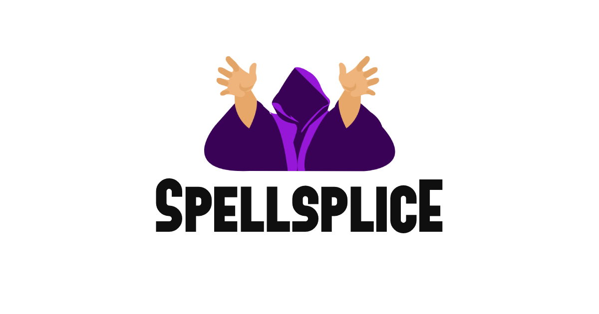

<div align="center">
  
  <p>Unofficial Magic: The Gathering video overlay editor.</p>
</div>


## Table of Contents

- [About](#about)
- [Features](#features)
- [Screenshots](#screenshots)
- [Install](#install)
- [Local Development](#local-development)
  - [Prerequisites](#prerequisites)
  - [Setup](#setup)
  - [Commands](#commands)
- [Roadmap](#roadmap)


## About

Spellsplice is an unofficial tool for creating synchronized overlays on Magic: The Gathering match recordings.

Load a video file, then use the timeline editor to mark in-game events — life changes, draws, discards, and more — at the exact moments they occur. The editor renders the current game state (life totals, hand sizes) as a canvas overlay in real time as the video plays, keeping everything in sync automatically.


## Features

- **Video playback** with frame-accurate canvas rendering
- **Interactive timeline** with zoom, scrubbing, and a draggable playhead
- **Basic event types**: Lose Life, Gain Life, Add to Hand, Remove from Hand, Reveal from Hand, Stack Top, Shuffle, Display Card
- **Drag-and-drop events** — reposition or move events between player tracks
- **Resizable duration events** — some events (like Display Card) span a time range and show as an overlay banner while active
- **Up to 4 players**, each with their own track
- **Live canvas overlay** showing each player's life total and hand size, updated frame-by-frame as events fire
- **Command palette** (Cmd+K) for quickly adding new events


## Screenshots

<div align="center">
  
</div>


## Install

_No release builds available yet._


## Local Development

### Prerequisites

- [Node.js](https://nodejs.org/) v24 (see `.nvmrc`)
- npm

### Setup

```bash
# Clone the repository
git clone https://github.com/your-username/spellsplice.git
cd spellsplice

# If using nvm
nvm use

# Install dependencies
npm install
```

### Commands

```bash
npm run dev      # Start the Vite dev server
npm run build    # Type-check and build for production
npm run preview  # Preview the production build locally
npm run lint     # Run ESLint

npx prettier --write .  # Format all files
```


## Roadmap

### v1 — Export Ready `[in progress]`

Everything needed to produce a complete, finished video.

- [x] Video playback with frame-accurate canvas rendering
- [x] Timeline editor
  - [x] Zoom, scrubbing, draggable playhead
  - [x] Drag-and-drop events across layers
  - [x] Resizable duration events
  - [x] Multi-event selection via rubber-band drag
  - [x] Command palette (Cmd+K) for adding events
- [x] Up to 4 players, each with their own multi-layer track
- [x] Live overlay: player name, life total, hand size
- [x] Inspector panel: edit event properties (cards via Scryfall autocomplete, life amounts)
- [ ] **Decklist import** - paste a decklist in MTGO format per player; card data and images are bulk-fetched from Scryfall once and cached locally for the session
  - [ ] Autocomplete in event fields draws from the cached deck first, falling back to global Scryfall search for off-deck cards
- [ ] **Cards-in-hand display** - always-visible stacked card title crops per player (Card Kingdom / Mengu's Workshop style), rendered from the local image cache
- [ ] **Video export** - render the overlay baked into the video, or export overlay-only, directly in the browser via WebAssembly FFmpeg
- [ ] **Add / remove players** - manage the player roster from within the app
- [ ] **Player name & deck name editing** in Inspector - changes reflect on the overlay in real time
- [ ] Complete all event types and state handlers:
  - [x] Add to Hand
  - [x] Remove from Hand
  - [x] Gain Life
  - [x] Lose Life
  - [ ] Reveal from Hand
  - [ ] Stack Top
  - [ ] Shuffle
  - [ ] Display Card


### v2 — Power Users `[future]`

Reduce repetition for common game actions.

- [ ] **Built-in macro library** - predefined event sequences for common spells (e.g. Brainstorm: +3 to hand, −2 from hand, stack top ×2)
- [ ] **User-defined macros** - create, name, and reuse custom event sequences without waiting for app-side support


### v3 — Creator Tools `[future]`

Full creative control over the final product.

- [ ] **Overlay UI editor** - drag, resize, and style every overlay element; choose fonts, colors, backgrounds, and which stats to show per player
- [ ] **Layout export & sharing** - export your overlay layout to a file and share it with others