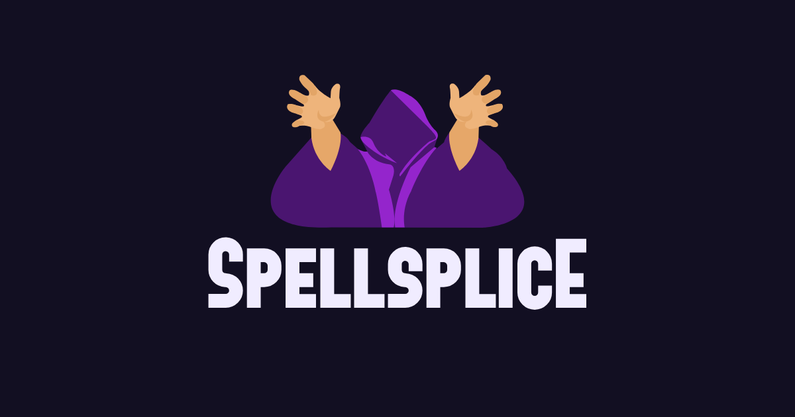
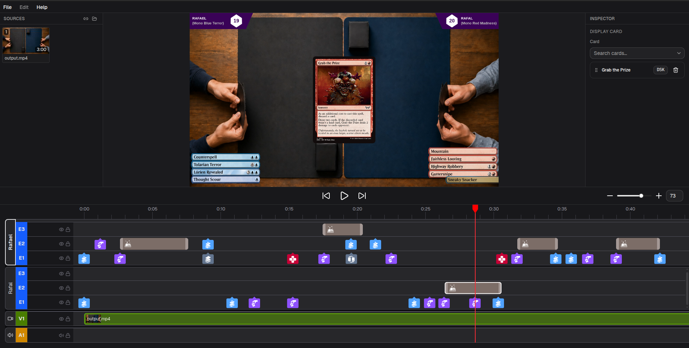
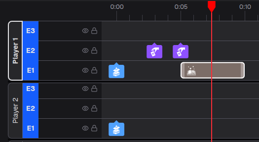
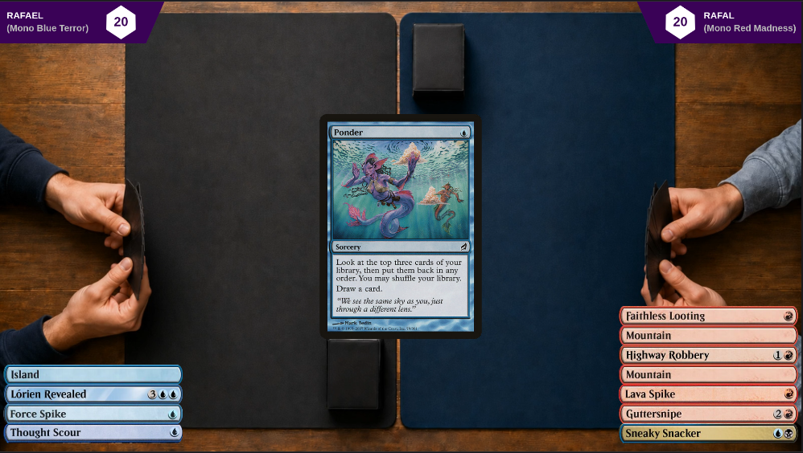
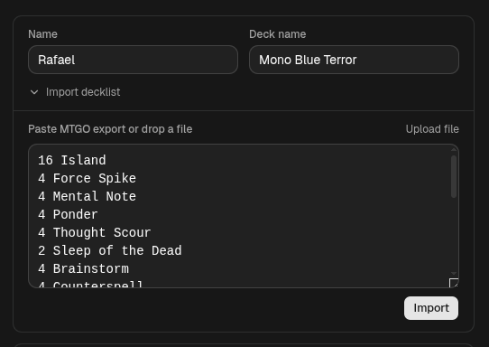
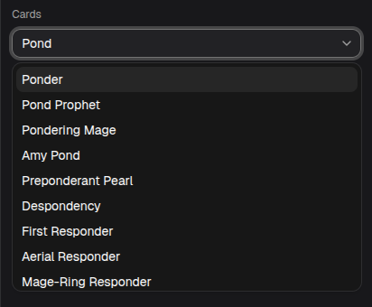
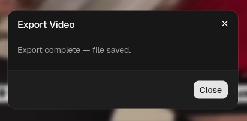

<div align="center">
  
</div>


## Table of Contents

- [About](#about)
- [Features](#features)
- [Screenshots](#screenshots)
- [Install](#install)
- [Local Development](#local-development)
  - [Prerequisites](#prerequisites)
  - [Setup](#setup)
  - [Commands](#commands)
- [Roadmap](#roadmap)
- [Attribution](#attribution)


## About

Spellsplice is an unofficial tool for creating synchronized overlays on Magic: The Gathering match recordings.

Load a video file, then use the timeline editor to mark in-game events — life changes, draws, discards, and more — at the exact moments they occur. The editor renders the current game state (life totals, hand sizes) as a canvas overlay in real time as the video plays, keeping everything in sync automatically.


## Features

- **Video playback** with frame-accurate canvas rendering
- **Non-linear timeline editor** — zoom, scrubbing, draggable playhead, rubber-band multi-select, command palette (Cmd+K)
- **Full event suite**: Lose Life, Gain Life, Add to Hand, Remove from Hand, Reveal from Hand, Stack Deck, Unstack Deck, Display Card, Win, Hide UI, Show UI, Reset
- **Drag-and-drop events** across layers and players; resizable duration events (e.g. Display Card) span a time range
- **Up to 4 players**, each with their own multi-layer track
- **Live canvas overlay** — player name, life total, and hand size rendered frame-by-frame as events fire
- **Cards-in-hand display** — stacked card title-bar crops per player, always visible on the overlay
- **Deck stack overlay** with entrance animation
- **Decklist import** — paste an MTGO-format decklist; card data and images are bulk-fetched from Scryfall and cached locally
- **Inspector panel** — edit event properties; card autocomplete draws from the cached deck first, falls back to Scryfall
- **Project export/import** — save and load the full timeline as a `.sps` file; media sources relink on open via a file picker
- **Video export** — bake the overlay into the video directly in the browser (Chrome/Edge; powered by WebCodecs + WebGL)
- **Settings dialog** — project metadata, player defaults, overlay appearance


## Screenshots

<div align="center">
  
  
  
  
  
  
</div>


## Local Development

### Prerequisites

- [Node.js](https://nodejs.org/) v24 (see `.nvmrc`)
- npm

### Setup

```bash
# Clone the repository
git clone https://github.com/rafael-graunke/spellsplice.git
cd spellsplice

# If using nvm
nvm use

# Install dependencies
npm install
```

### Commands

```bash
npm run dev      # Start the Vite dev server
npm run build    # Type-check and build for production
npm run preview  # Preview the production build locally
npm run lint     # Run ESLint

npx prettier --write .  # Format all files
```


## Roadmap

### v1 - Export Ready `[released]`

Everything needed to produce a complete, finished video.

- [x] Video playback with frame-accurate canvas rendering
- [x] Timeline editor
  - [x] Zoom, scrubbing, draggable playhead
  - [x] Drag-and-drop events across layers
  - [x] Resizable duration events
  - [x] Multi-event selection via rubber-band drag
  - [x] Command palette (Cmd+K) for adding events
- [x] Two players, each with their own multi-layer track
- [x] Live overlay: player name, life total, hand size
- [x] Inspector panel: edit event properties (cards via Scryfall autocomplete, life amounts)
- [x] **Decklist import** - paste a decklist in MTGO format per player; card data and images are bulk-fetched from Scryfall once and cached locally for the session
  - [x] Autocomplete in event fields draws from the cached deck first, falling back to global Scryfall search for off-deck cards
- [x] **Cards-in-hand display** - always-visible stacked card title crops per player (Card Kingdom / Mengu's Workshop style), rendered from the local image cache
- [x] **Project export/import** - save and load the full timeline (players, events, clips, deck data) as a `.sps` file; media sources relink on open via a file picker
- [x] **Video export** - render the overlay baked into the video, or export overlay-only, directly in the browser
- [x] **Player name & deck name editing** in Inspector - changes reflect on the overlay in real time
- [x] Complete all event types and state handlers:
  - [x] Add to Hand
  - [x] Remove from Hand
  - [x] Gain Life
  - [x] Lose Life
  - [x] Display Card
  - [x] Reveal from Hand
  - [x] Stack Deck
  - [x] Unstack Deck


### v2 - Streaming & Creator Tools `[future]`

Live streaming support and full creative control over the overlay.

- [ ] **Non-linear video editing** - Sources panel holds imported video files; drag clips onto a dedicated video track on the timeline just like events; cuts and trims work without affecting overlay event timing since everything lives in output-timeline time
- [ ] **Annotation system** - generic titled card-list overlays replacing the hardcoded deck-stack; multiple simultaneous annotations per player (e.g. "Top of deck" + "Pithing Needle naming"); project-level slot registry with system slots and user-defined slots; slot titles are editable and resolve at render time so macros can target slots by ID regardless of what the user named them
- [ ] **Built-in macro library** - predefined event sequences for common spells (e.g. Brainstorm: +3 to hand, −2 from hand, annotate top-of-deck slot ×2)
- [ ] **User-defined macros** - create, name, and reuse custom event sequences without waiting for app-side support
- [ ] **Overlay UI editor** - drag, resize, and style every overlay element; choose fonts, colors, backgrounds, and which stats to show per player
- [ ] **Layout export & sharing** - export your overlay layout to a file and share it with others
- [ ] **Add / remove players** - manage the player roster from within the app
- [ ] **Live overlay mode** - manage an event stack in the controller, overlay renders chroma-keyed and syncs via BroadcastChannel; opens as a popup window for clean OBS Window Capture


### v3 - Desktop App `[future]`

Native desktop experience with offline-first card data and faster video export, built on [Tauri](https://tauri.app/) (Rust backend + system webview).

- [ ] **Tauri wrapper** - same React UI, distributed as a native desktop app (~5–10 MB runtime vs ~150 MB for Electron)
- [ ] **FFmpeg video export** - replace WebCodecs pipeline with FFmpeg via Rust backend; order-of-magnitude faster, works on all platforms
- [ ] **Scryfall bulk data** - download the full card database (~2.3 GB) on first run; SQLite + FTS5 index (via `rusqlite`) for sub-millisecond lookups with no API rate limits


## Attribution

Spellsplice is unofficial Fan Content permitted under the [Wizards of the Coast Fan Content Policy](https://company.wizards.com/en/legal/fancontentpolicy). Not approved/endorsed by Wizards. Portions of the materials used are property of Wizards of the Coast. ©Wizards of the Coast LLC.

Wordmark uses [FORQUE](https://www.fontsquirrel.com/fonts/forque) by Tup Wanders (CC BY).
